# myEnedis

[](https://github.com/custom-components/hacs)


**Cette integration est compatible avec la carte :
https://github.com/saniho/content-card-linky**

**Un question ? Un problème ? Une demande ? Venez en parler sur le
[fil de discussion dédié](https://forum.hacf.fr/t/sensor-pour-enedis-apienedis/935)
sur le [forum HACF](https://forum.hacf.fr/).**

## Bienvenue !

Cette intégration fonctionne à l'aide de la passerelle fournie par
https://enedisgateway.tech/.

Avant de pouvoir utiliser cette intégration, assurez vous :

- D'avoir validé la partage de données avec la
  [passerelle](https://enedisgateway.tech/),
- Et d'avoir activé sur votre
  [espace privé Enedis](https://mon-compte-client.enedis.fr/) la remontée
  des informations de votre linky.

## Installer l'intégration

<details>
  <summary><b>Via HACS (mise à jour en un clic) : </b></summary><br />

- Ouvrez HACS, cliquez sur `Intégration`, puis selectionnez le menu 3
  points en haut à droite.

\*si vous n'avez pas HACS, pour l'installer cela se passe ici :
[HACS : Ajoutez des modules et des cartes personnalisées](https://forum.hacf.fr/t/hacs-ajoutez-des-modules-et-des-cartes-personnalisees/359)

<br />
 <p align="center">
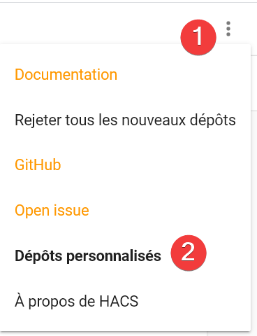
 <br />
 </p>

- Ajoutez le dépot personnalisé : `https://github.com/saniho/apiEnedis`

<br />
 <p align="center">
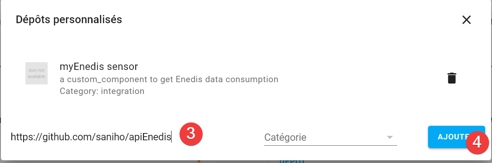
 <br />
 </p>

- Cliquez sur le bouton `Installer` de la carte correspondant à
  l'intégration

<br />
 <p align="center">
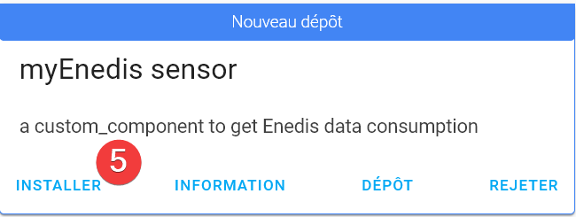
 <br />
 </p>

- Cliquez sur le bouton `Installer` de la popup

<br />
 <p align="center">
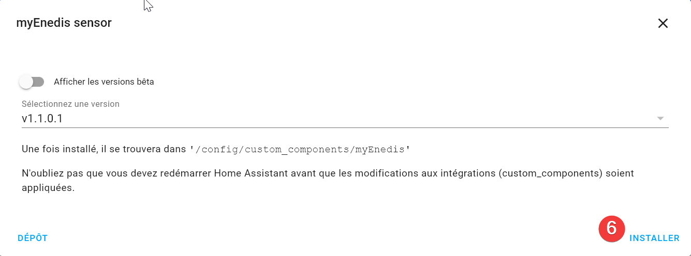
 <br />
 </p>

- La carte de l'intégration est maintenant rouge, signifiant qu'un
  redémarrage du serveur Home Assistant est nécessaire

<br />
 <p align="center">
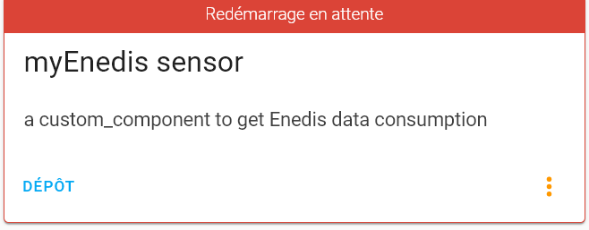
 <br />
 </p>

- Accédez à la vue `Contrôle du serveur` (`Configuration` ->
  `Contrôle du serveur`), puis cliquez sur le bouton `Redémarrer` dans la
  zone `Gestion du serveur`

<br />
 <p align="center">
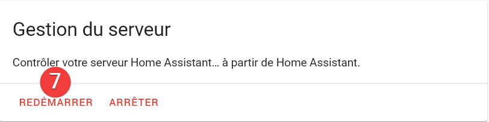
 <br />
 </p>

</details>

<details>
  <summary><b>Manuellement (à faire à chaque mise à jour)</b></summary>

- Dans votre propre dossier `custom_components`, créez un dossier nommé
  `apiEnedis` puis, copiez tout le contenu du dossier
  [apiEnedis](https://github.com/saniho/apiEnedis/tree/main/custom_components/apiEnedis)
  dedans.

- Cliquez sur le bouton `Redémarrer` dans la zone `Gestion du serveur`

</details>

## Ajouter l'intégration

<details>
  <summary><b>Via l'interface graphique</b></summary>

- Accédez à la vue `Intégrations` (`Configuration` -> `Intégration`)

- Appuyez sur le bouton bleu `Ajouter l'intégration` en bas à droite de la
  vue

<br />
 <p align="center">
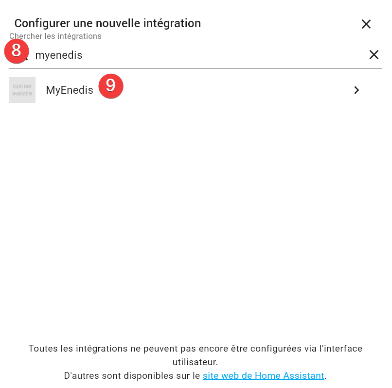
 <br />
 </p>

- Tapez dans le champ de recherche qui vient d'apparaître : `myenedis` et
  cliquez sur l'intégration

<br />
 <p align="center">
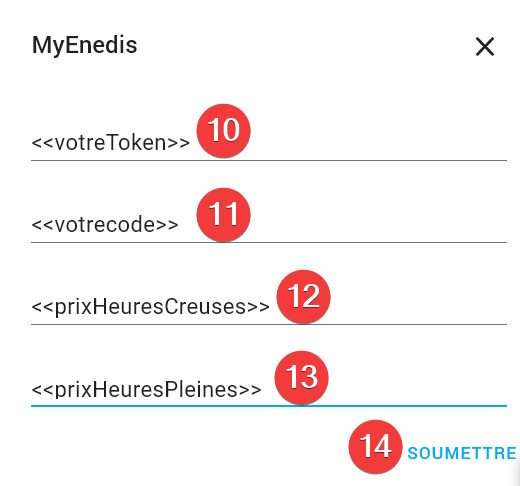
 <br />
 </p>

- Renseigner :

  - Votre `token`
  - Votre `code` (PDL)
  - Si vous disposez d'un contrat heures pleines/heures creuses :
    - Le prix des heures creuses
    - Le prix des heures pleines
  - cocher la case heures creuses si votre contrat comporte des heures
    creuses
  - vos heures creuses si différentes de celles proposées par enedis
    exemple de format : `[['00:00','05:00'], ['22:00', '24:00']]`

- Validez la saisie avec le bouton `Soumettre`

<br />
 <p align="center">
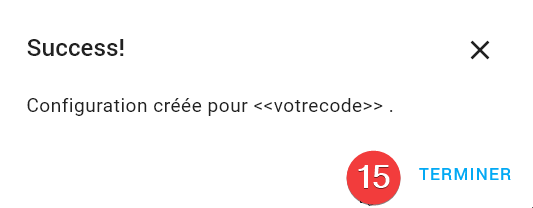
 <br />
 </p>

- Fermez la popup de confirmation en cliquant sur le bouton `Terminer`

*Si vous ne voyez pas l'intégration dans la liste, effacer le cache de
votre navigateur en faisant la combinaison de touche `CTRL+F5` ou
`CTRL+SHIFT+R`*

</details>
<details>
  <summary><b>En YAML << OBSOLETE >></b></summary>
</details>

### Redémarrer votre serveur Home Assistant

## Entité disponible

L'intégration crée l'entité `sensor.myenedis_<<votrecode>>`

<br />
 <p align="center">
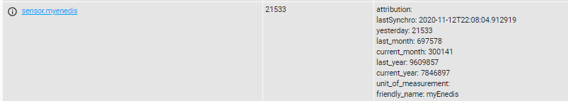
 <br />
 </p>

## "Ca ne marche pas"

### Forum HACF.FR

______________________________________________________________________

N'hésitez pas à aller faire un tour sur ce forum ou vous trouverez pleins
d'informations

https://forum.hacf.fr/t/hacs-ajoutez-des-modules-et-des-cartes-personnalisees/359

______________________________________________________________________


### Activer le débogue

<details>
  <summary><b>Via l'interface, temporairement : </b></summary><br />

Avec des traces de débogue il est généralement plus facile d'identifier
la cause d'un problème de fonctionnement.

Une manière c'est d'activer les messages de débogue dans le fichier
`config/home-assistant.log` en l'activant depuis l'interface.  Pour cela allez
directement vers [Outils de Développement > Services](https://my.home-assistant.io/redirect/developer_services/).

Puis, passer en mode `YAML` et copiez-collez le code suivant, puis cliquez
`APPELER LE SERVICE`:

```yaml
service: logger.set_level
data:
  myEnedis: debug

```

En image:

<p align="center">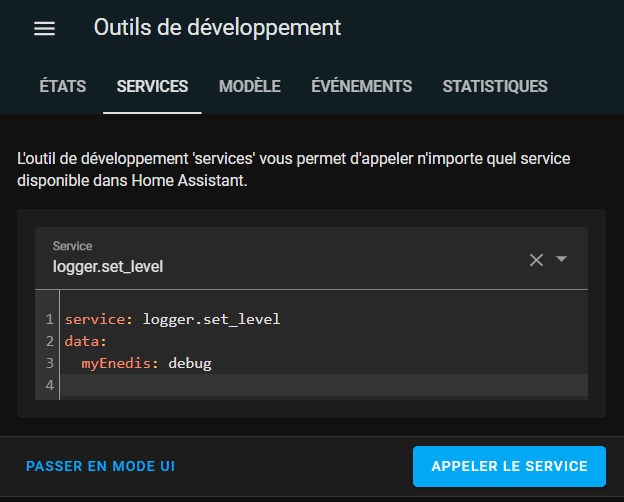</p>

Le fichier `config/home-assistant.log` se remplit alors de pleins de traces
de débogue lié à `apiEnedis` connu comme `myEnedis` dans Home Assistant.


Ceci continue jusqu'au redémarrage de Home Assistant ou jusqu'à ce que vous
exécutez de la même manière que pour l'activation:


```yaml
service: logger.set_level
data:
  myEnedis: warning

```
</details>


## Historique des versions

Cette partie n'est pas tenu à jour.

<details>
  <summary><b>VERSION</b></summary>

**2.0.0.0** myElectricData

**ajout de la possibilité d'utiliser myElectricData**

Attention le service enedisGateway sera desactivé en mai 2023, mais myElectricData prendra la releve.

Pensez à vous enregistrer sur https://www.myelectricaldata.fr/

**1.2.0.0** refactoring du code

**suppression de la configuration possible par le fichier yaml, uniquement
possible via l'integration**

heures creuses disponible dans l'interface de l'integration

**1.1.2.2** possibilité de forcer ses propres horaires dans le yaml(
differentes de celles de enedis)

tag heures_creuses

Possibilité de forcer l'absence de HC/HP, meme si Enedis en fournit

tag heuresCreusesON

dans l'integration yaml et via flow, possibilité de forcer l'absence de
HC/HP

`heuresCreusesON: False`

**1.1.0.0**

nouvelle version, permettant l'integration via flow

**1.0.4.0**

gestion de contrat recent, correction calcul de monté si relevé compteur
par tranche de 10 minutes, 30 minutes

attention le nom du sensor contiendra maintenant le numéro de PDL( cela
permet de piloter plusieurs compteurs )

**1.0.2.5**

state general du sensor converti en Kwh

correction de bugs

**1.0.2.4**

add Unit of measurement

**1.0.2.3**

correction bug

**1.0.2.2**

ajout de la gestion des heures HC/HP, pour cela indiquer dans votre sensor
yalm les tranches horaires

ajout gestion du calcul du prix sur la veille

**changement du nom du sensor dans le sensor.yaml, myEnedis remplace
apiEnedis**

**1.0.2.0**

integration à HACS

**changement du nom du sensor dans le sensor.yaml, myEnedis remplace
apiEnedis** **1.0.1.2**

Delay est maintenant facultatif dans sensor.yaml

ajout de la consmmation last week, and current week

**1.0.1.1**

gestion des contrats de moins de 2 ans

remonté d'un statut indiquant l'erreur remonté par la gateway s'il y a
erreur

**1.0.1.0**

ajout de la remontée yesterday au niveau du state pour permettre
l'utilisation par certaines card( graphique par exemple )

**1.0.0.0**

premiere version

</details>
