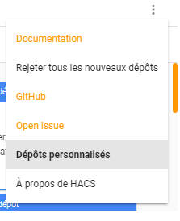
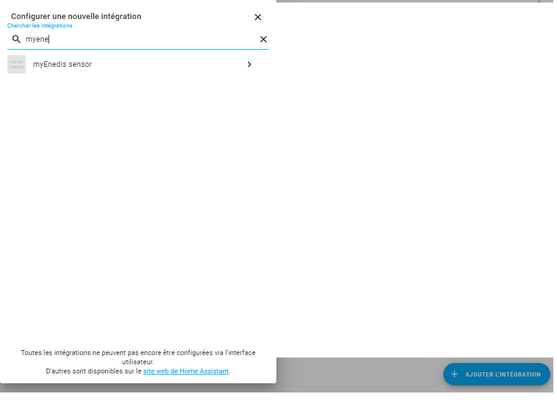

# myEnedis

Bienvenue ici sur une intégration de la gateway fournie par https://enedisgateway.tech/

Pour pouvoir l'utiliser, vous devez d'abord avoir validé la partage de données avec cette gateway, mais également
sur votre espace privé Enedis activé la remontée des informations de votre linky.

Ensuite, via HACS, rajouté le github https://github.com/saniho/apiEnedis dans depot personnalisé



* si vous n'avez pas HACS, pour l'installer cela se passe ici : https://hacs.xyz/docs/installation/installation

Ensuite deux choix, soit automatiquement : via le menu integration de votre HomeAssistant



ou sinon manuellement via le sensor

exemple de configuration sensors.yaml

```
# enedis
- platform: myEnedis
  token: <<votreToken>>
  code: <<votrecode>> 
  hc_cout: 0.1230
  hp_cout: 0.1580
  scan_interval: 3600
```

Ensuite vous aurez le sensor de disponible : 


**Cette integration est compatible avec la card suivante : 

https://github.com/saniho/content-card-linky**


_**VERSION**_

**1.1.0.0**

nouvelle version, permettant l'integration via flow

**1.0.4.0**

gestion de contrat recent, correction calcul de monté si relevé compteur par tranche de 10 minutes, 30 minutes

attention le nom du sensor contiendra maintenant le numéro de PDL( cela permet de piloter plusieurs compteurs )

**1.0.2.5**

state general du sensor converti en Kwh

correction de bugs

**1.0.2.4**

add Unit of measurement

**1.0.2.3**

correction bug

**1.0.2.2**

ajout de la gestion des heures HC/HP, pour cela indiquer dans votre sensor yalm les tranches horaires

ajout gestion du calcul du prix sur la veille

**changement du nom du sensor dans le sensor.yaml, myEnedis remplace apiEnedis**

**1.0.2.0**

integration à HACS

**changement du nom du sensor dans le sensor.yaml, myEnedis remplace apiEnedis**
**1.0.1.2**

Delay est maintenant facultatif dans sensor.yaml

ajout de la consmmation last week, and current week

**1.0.1.1**

gestion des contrats de moins de 2 ans

remonté d'un statut indiquant l'erreur remonté par la gateway s'il y a erreur

**1.0.1.0**

ajout de la remontée yesterday au niveau du state pour permettre l'utilisation par certaines card( graphique par exemple )

**1.0.0.0**

premiere version

