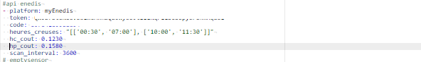

# apiEnedis

exemple de configuration sensors.yaml

```
# enedis
- platform: myEnedis
  token: <<votreToken>>
  code: <<votrecode>>  
  heures_creuses: "[['00:30', '07:00'], ['10:00', '11:30']]"
  hc_cout: 0.1230
  hp_cout: 0.1580
  scan_interval: 3600
```




_**VERSION**_

**1.0.2.5**

state general du sensor converti en Kwh

correction de bugs

**1.0.2.4**

add Unit of measurement

**1.0.2.3**

correction bug

**1.0.2.2**

ajout de la gestion des heures HC/HP, pour cela indiquer dans votre sensor yalm les tranches horaires

ajout gestion du calcul du prix sur la veille

**changement du nom du sensor dans le sensor.yaml, myEnedis remplace apiEnedis**

**1.0.2.0**

integration à HACS

**changement du nom du sensor dans le sensor.yaml, myEnedis remplace apiEnedis**
**1.0.1.2**

Delay est maintenant facultatif dans sensor.yaml

ajout de la consmmation last week, and current week

**1.0.1.1**

gestion des contrats de moins de 2 ans

remonté d'un statut indiquant l'erreur remonté par la gateway s'il y a erreur

**1.0.1.0**

ajout de la remontée yesterday au niveau du state pour permettre l'utilisation par certaines card( graphique par exemple )

**1.0.0.0**

premiere version

